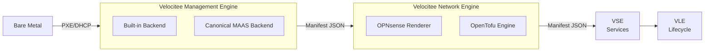

# Velocitee Core

[](https://github.com/velocit-ee/core/actions/workflows/ci.yml)
[](LICENSE)

**Velocitee Core** is a modular Infrastructure as Code (IaC) execution engine written in Python. It provides a pipeline for provisioning bare-metal hardware and managing network states, acting as an abstraction layer over tools like OpenTofu, Ansible, and Canonical MAAS.

---

## Architecture Overview

Velocitee is designed as a pipeline of independent engines. Each engine is responsible for a specific lifecycle phase, producing a structured JSON handoff manifest for the next engine.



### Engines
- **VME (Provisioning):** Handles PXE booting and unattended OS installations (Ubuntu, Debian, Proxmox VE). Supports a lightweight `builtin` backend or integration with `maas`.
- **VNE (Network):** Manages VLANs, DHCP, DNS, and firewalls via OPNsense. Configuration is declarative and rendered via OpenTofu.
- **VSE / VLE:** (Planned) Stateful service deployment and lifecycle drift detection.

---

## Local Development & CI

This repository enforces strict linting (`ruff`) and testing (`pytest`) via GitHub Actions. 

```bash
# 1. Clone the repository
git clone https://github.com/velocit-ee/core
cd core/vme

# 2. Set up virtual environment
python -m venv .venv && source .venv/bin/activate

# 3. Install dependencies
pip install -r requirements.txt -r requirements-dev.txt

# 4. Run the test suite
python -m pytest shared/tests/ tools/tests/ vme/cli/tests/
```

## Configuration

Engines load configuration from a `vme-config.yml` file. Sensitive variables should be injected via environment variables or a secure vault, never hardcoded.

Example VME Configuration:
```yaml
backend: builtin
network:
  management_cidr: 192.168.1.0/24
  dhcp_range: 192.168.1.100-192.168.1.200
```

## Contributing

We welcome contributions. All code must pass the CI pipeline (`ruff check` and `pytest`).
See [CONTRIBUTING.md](CONTRIBUTING.md) for contribution guidelines.

## License

Apache License, Version 2.0. See [LICENSE](LICENSE) for details.
